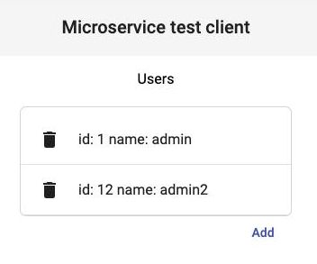
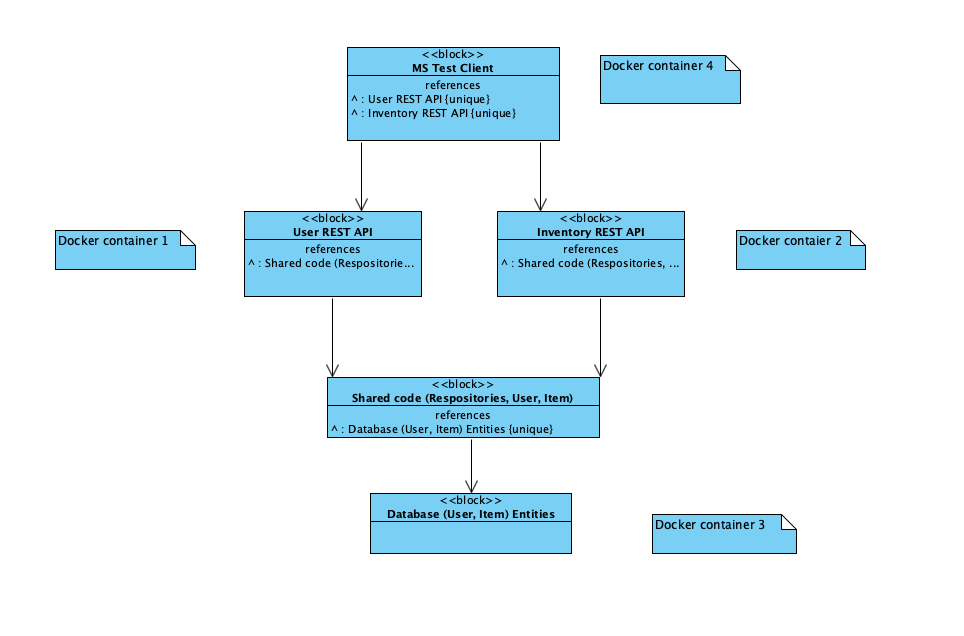

# iti0215-distributed-systems

The main goal is to create project which represents a minimalistic microservice
architecture. This project is based on Java 11  and gradle version 6.8.1.
To run all services please take a look at the **Build and Run all microservices**.
If you want ro run services faster, then please comment out the ms-client in the
docker-compose.yml and run the client locally.  

Required tools: **Gradle** starting from 6.8.1, **npm** any 6th version
and **Docker**.

## Build backend
`gradle build
`

## Init frontend
`cd ms-cleint
` 

`npm init
`

## Build and Run the frontend locally :rocket:
`npm start
`

## Build and Run all microservices :rocket:
`gradle build && docker-compose up --build
`

## Request examples
`http://localhost:8080/user-api/v1/user  
`
  
`http://localhost:8081/inventory-api/v1/item/10
`

## Structure

### User api (microservice)
Base url: http://localhost:8080/user-api/v1/user  
Provides REST Api endpoints for user CRUD operations.

### Inventory api (microservice)
Base url: http://localhost:8081/inventory-api/v1/item  
Provides REST Api endpoints for user's item CRUD operations.

### MsTest Client (frontend)
Base url: http://localhost:4200  
Simple SPA client which can be used for testing ms REST endpoints.  

### PostgreSQL (database)
Microservices use the database for storing users and user's items.  
Ideally each ms should have it's own database but for the demo it's not required.

